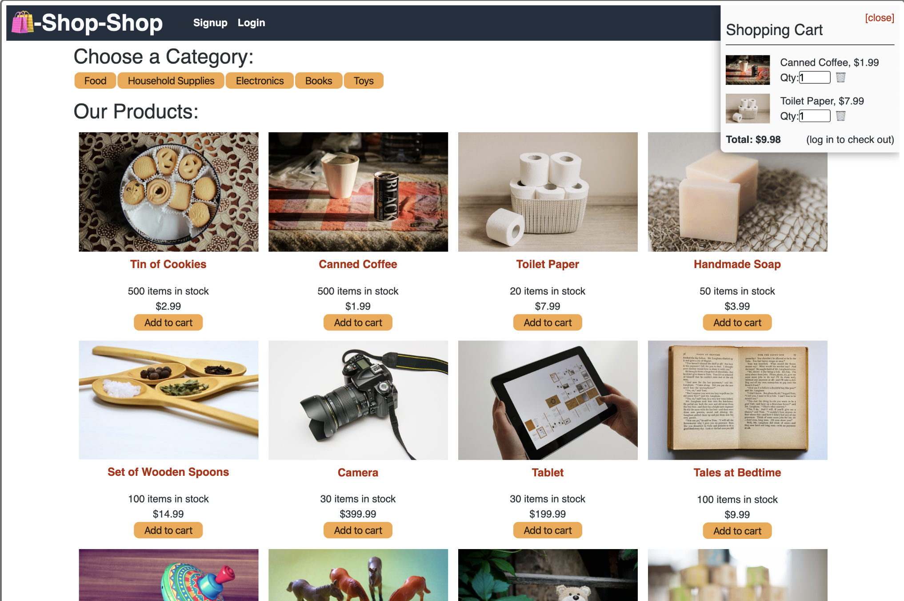

# Shop-Shop

## Description
* A simple e-commerce web application that uses React for the front end, Express and Apollo for the server, and MongoDB for the database. 
* Utilizes the React Context API to implement a Redux-like store to manage state globally. 
* IndexedDB for offline functionality 

## Deployed Website
This application is deployed on Heroku.  
Deployed Site: to come...

## Built With
* React
* Express
* MongoDB
* Mongoose
* GraphQL
* Apollo Server

## Preview
Homepage  
  

## Questions
Feel free to reach out to me for any questions or comments.  
Link to my GitHub: github.com/lindseymiller2567